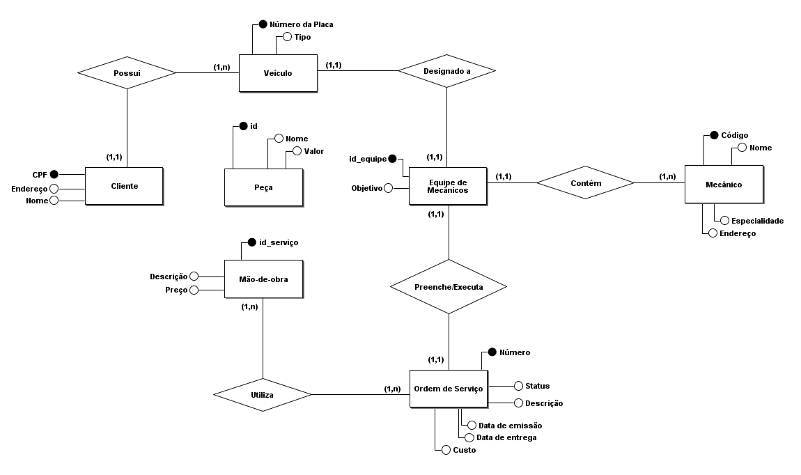
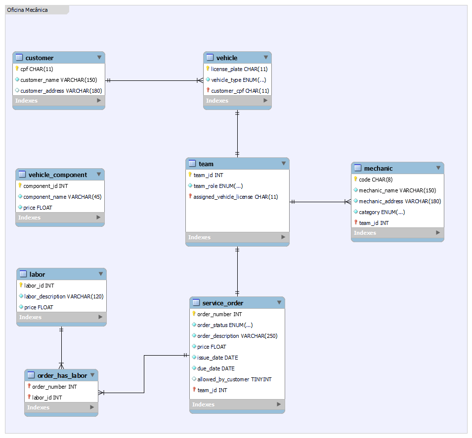

# Descrição

Modelagem de dados para um sistema de controle e execução de **ordens de serviço (OS)** utilizando diagrama ER para o esquema conceitual e diagrama EER para o esquema lógico, além disso, está incluído um script que pode ser usado com o SGBD PostgreSQL.

---

## Narrativa

- Clientes levam veículos à oficina mêcanica para serem consertados ou para passarem por revisões periódicas;
- Cada veículo é designado a uma equipe de mecânicos que identifica os serviços a serem executados e preenche uma **OS** com data de entrega;
- A partir da **OS**, calcula-se o valor de cada serviço, consultando-se uma tabela de referência de mão-de-obra;
- O valor de cada peça também irá compor a **OS**;
- O cliente autoriza a execução dos serviços;
- A mesma equipe avalia e executa os serviços;
- Os mecânicos possuem código, nome, endereço e especialidade;
- Cada **OS** possui: n°, data de emissão, um valor, status e uma data para conclusão dos trabalhos.

---

## Esquemas

### Conceitual

Este projeto está no arquivo `oficina_conceitual.brM3` que foi feito utilizando a ferramenta **brModelo**.

---

### Lógico

Este projeto está presente no arquivo `oficina_mecanica.mwb` e pode ser aberto com o software **MySQL Workbench**.

---

### Físico

O arquivo `db_script.sql` permite criar o esquema físico no SGBD **PostgreSQL**. Neste script há comandos responsáveis por fazer definições (DDL), manipulações (DML) e consultas (DQL) ao banco de dados.

> Dica: Este script pode ser executado no **psql** utilizando o comando `\i` juntamente com o caminho completo do arquivo `.sql`.
